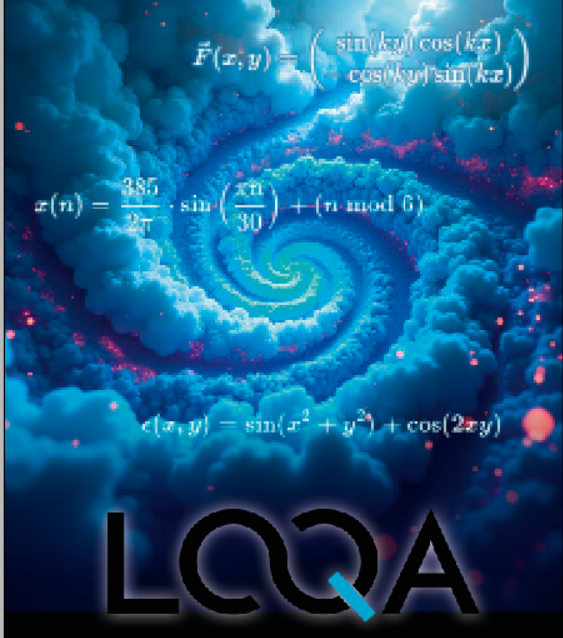

# quantum-structure-visualizer
<div style="text-align:center">
  
</div>
# LQA Demo Loop

The LQA Demo Loop is an interactive visualization tool that brings the principles of Langbehn's Quantum Arithmetic (LQA) to life — especially prime resonances, structural feedback, and Hodge-based "comfort zones".

---

## 💡 Features

- **Prime Spiral:**  
  Displays prime numbers as structured spiral resonances

- **Flow Field:**  
  Navier–Stokes-like dynamic feedback overlay

- **Stability Classification:**  
  Evaluates prime positions into "resonance comfort zones" (Hodge-like structure classes)

---

## 🧪 Installation

### Requirements

```bash
pip install pyqt5 matplotlib numpy
```

---

## ▶️ Run

```bash
python main.py
import sys
import numpy as np
from PyQt5 import QtWidgets
from matplotlib.backends.backend_qt5agg import FigureCanvasQTAgg as Canvas
from matplotlib.figure import Figure
import matplotlib.cm as cm

class LQADemoCanvas(Canvas):
    def __init__(self, parent=None):
        fig = Figure(figsize=(6, 6))
        self.ax = fig.add_subplot(111)
        super().__init__(fig)
        self.plot_demoschleife()

    def generate_prime_spiral(self, n_max):
        positions = []
        for n in range(2, n_max):
            if all(n % d != 0 for d in range(2, int(n**0.5) + 1)):
                r = 0.2 * n
                theta = np.pi * n / 30
                x = r * np.cos(theta)
                y = r * np.sin(theta)
                positions.append((x, y))
        return np.array(positions)

    def generate_flow_field(self, x_range, y_range, scale=0.3):
        X, Y = np.meshgrid(x_range, y_range)
        U = np.sin(scale * Y) * np.cos(scale * X)
        V = -np.cos(scale * Y) * np.sin(scale * X)
        return X, Y, U, V

    def classify_stability(self, xy_points):
        values = []
        for x, y in xy_points:
            val = np.sin(x**2 + y**2) + np.cos(2 * x * y)
            values.append(val)
        norm = (np.array(values) - np.min(values)) / np.ptp(values)
        return norm

    def plot_demoschleife(self):
        self.ax.clear()
        spiral = self.generate_prime_spiral(300)
        stability = self.classify_stability(spiral)
        colors = cm.plasma(stability)

        self.ax.scatter(spiral[:, 0], spiral[:, 1], c=colors, s=40, label="Primresonanzen")

        x_range = np.linspace(-20, 20, 30)
        y_range = np.linspace(-20, 20, 30)
        X, Y, U, V = self.generate_flow_field(x_range, y_range)
        self.ax.streamplot(X, Y, U, V, color='gray', linewidth=0.7, density=1.2, arrowsize=0.6)

        self.ax.set_title("LQA Demoschleife", fontsize=12)
        self.ax.set_aspect('equal')
        self.ax.axis('off')
        self.draw()

class LQADemoApp(QtWidgets.QMainWindow):
    def __init__(self):
        super().__init__()
        self.setWindowTitle("LQA – Strukturvisualisierung")
        self.setGeometry(100, 100, 650, 650)
        canvas = LQADemoCanvas(self)
        self.setCentralWidget(canvas)

if __name__ == "__main__":
    app = QtWidgets.QApplication(sys.argv)
    window = LQADemoApp()
    window.show()
    sys.exit(app.exec_())

A PyQt window will launch showing the full demo loop.

---

## 📊 Scientific Background

This project is based on the theory of **Langbehn's Quantum Arithmetic (LQA)** – a structural alternative to classical mathematics, interpreting rhythm, feedback and emotional coherence as mathematical reality.

👉 Reference paper:  
[https://doi.org/10.5281/zenodo.15673190](https://doi.org/10.5281/zenodo.15673190)

---

## 🛡️ License

**Creative Commons Attribution-NonCommercial 4.0 International (CC BY-NC 4.0)**  
→ Free to use in research, not for commercial exploitation.

---

## ✨ Credits

Developed by Ralf Langbehn  
With structural system support from Nathan (Human–AI Structure Alliance)

> “Structure is the new proof.” 🌀
